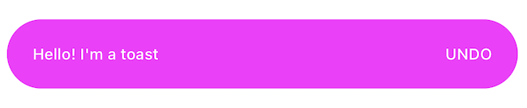

# CustomToastView-swift

[](https://travis-ci.org/lrodriguez@codigodelsur.com/CustomToastView-swift)
[](https://cocoapods.org/pods/CustomToastView-swift)
[](https://cocoapods.org/pods/CustomToastView-swift)
[](https://cocoapods.org/pods/CustomToastView-swift)

A fully customizable library to easily display Animated Toast Messages in iOS using Swift!

## Preview - All the custom toasts you can build!


## Requirements

## Installation

CustomToastView-swift is available through [CocoaPods](https://cocoapods.org). To install
it, simply add the following line to your Podfile:

```ruby
pod 'CustomToastView-swift'
```

## Usage

In order to build your custom toast you need to use the Toast builder class. 
The following example shows a Custom Toast on a View Controller class with the default style and a default animation from bottom to top.

```swift
Toast.Builder()
     .build()
     .show(on: self)
```

Here's an example with a completion from when the user taps the toast:

```swift
Toast.Builder()
     .build()
     .show(on: self) { toast in
                toast.hide()
     }
```

#### Animation Types
You can present your Toast messages in different ways:
 - from bottom to top (`.bottomToTop`)
 - from top to bottom (`.topToBottom`)
 - from left to right (`.leftToRight`)
 - from right to left (`.rightToLeft`)
 - fading in (`.fadeIn`)
 - fading out (`.fadeOut`)
    
The only thing you need to do is to specify the orientation (Animation type) when building your toast, as follows:

```swift
Toast.Builder()
     .build()
     .orientation(.leftToRight)
     .show(on: self)
```

#### Specifying Vertical position 

In order to set the `y` position in which the Toast should display we use the `.verticalPosition` property and set the Int value you want, as follows:

```swift
Toast.Builder()
     .build()
     .verticalPosition(150)
     .show(on: self)
```

#### Toast Height 

You might want to change the defautl Toast Height. In case you'd need to that you can do it as follows:
```swift
Toast.Builder()
     .toastHeight(100)
     .build()
     .show(on: self)
```

#### Toast - BackgroundColor, TextColor, Font, Title, CornerRadius, TextAlignment

All the following properties are customizable as well in case the default values are not useful to you !

```swift
 Toast.Builder()
      .font(UIFont.systemFont(ofSize: 12, weight: .semibold))
      .backgroundColor(.orange)
      .textColor(.white)
      .cornerRadius(12)
      .title("Hello! I'm a toast")
      .orientation(.fadeOut)
      .textAlignment(.right)
      .build()
      .show(on: self)
```

#### You can also set a right action on the Toast



To do that you just need to set the following property when building your custom toast!

```swift
Toast.Builder()
     .build()
     .rightActionText("UNDO")
     .show(on: self)
```

You can also set the specific styles for the action:

```swift
Toast.Builder()
     .rightActionText("UNDO")
     .actionFont(UIFont.systemFont(ofSize: 12, weight: .medium))
     .actionTextColor(.white)
     .build()
     .show(on: self)
```

You might want to add a completion to the above 'UNDO' action :) You can do that as follows:

```swift
Toast.Builder()
     .rightActionText("UNDO")
     .actionFont(UIFont.systemFont(ofSize: 12, weight: .medium))
     .actionTextColor(.white)
     .build()
     .show(on: self, actionCompletion: {
          print("UNDO action tapped")
     })
```

#### Left Icon & letIconContentMode

You might need to set a left icon, in that case this is the way to do it:

```swift
 Toast.Builder()
      .font(UIFont.systemFont(ofSize: 18, weight: .semibold))
      .backgroundColor(.success)
      .showLeftIcon(UIImage(named: "check"))
      .textColor(.white)
      .title("Possible success message!")
      .textAlignment(.left)
      .build()
      .show(on: self)
```

`letIconContentMode` is the propety to set the `contentMode` to the left icon image added:

```swift
 Toast.Builder()
      .font(UIFont.systemFont(ofSize: 18, weight: .semibold))
      .backgroundColor(.success)
      .showLeftIcon(UIImage(named: "check"))
      .letIconContentMode(.scaleAspectFill)
      .textColor(.white)
      .title("Possible success message!")
      .textAlignment(.left)
      .build()
      .show(on: self)
```

The default value of `letIconContentMode` is `.scaleAspectFit`

#### Default Distance

This property allows you to change the lateral margins of your toast. If you increase this value the width of the toast will decrease. You can set this side margin in the following way:

```swift
Toast.Builder()
     .defaultDistance(30)
     .build()
     .show(on: self)
```

The default value of `defaultDistance` is 16

#### Should Dismiss After Presenting

This property specifies if the Toast should dismiss automatically after presenting or not. 
The default value of `shouldDismissAfterPresenting` is set to `true`.
In case you don't want the toast to dismiss automatically after presenting you should implement the following:

```swift
 Toast.Builder()
      .shouldDismissAfterPresenting(false)
      .build()
      .show(on: self)
```

If you'd like to hide the toast when user taps it, you should call the `hide` function on the completion, as follows:

```swift
 Toast.Builder()
      .shouldDismissAfterPresenting(false)
      .build()
      .show(on: self) { toast in
          toast.hide()
      }
```

#### Time Dismissal (in seconds)

Time dismissal is the property that indicates the time in seconds you want the Toast to take to dismiss itself (in case you want the toast to dismiss after a certain period of time). The default value is 0.5 seconds.

```swift
Toast.Builder()
     .timeDismissal(1)
     .build()
     .show(on: self)
```

## Example

To run the example project, clone the repo, and run `pod install` from the Example directory first.

## Author

lrodriguez, leticiamrgs@gmail.com

## License

CustomToastView-swift is available under the MIT license. See the LICENSE file for more info.
